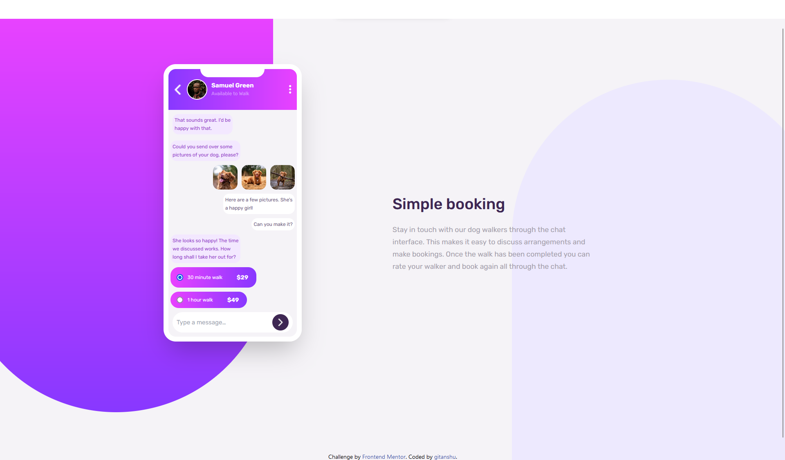

# Frontend Mentor - Chat app CSS illustration solution

This is a solution to the [Chat app CSS illustration challenge on Frontend Mentor](https://www.frontendmentor.io/challenges/chat-app-css-illustration-O5auMkFqY). Frontend Mentor challenges help you improve your coding skills by building realistic projects. 

## Table of contents

- [Overview](#overview)
  - [The challenge](#the-challenge)
  - [Screenshot](#screenshot)
  - [Links](#links)
- [My process](#my-process)
  - [Built with](#built-with)
  - [What I learned](#what-i-learned)
  - [Continued development](#continued-development)
  - [Useful resources](#useful-resources)
- [Author](#author)
- [Acknowledgments](#acknowledgments)

**Note: Delete this note and update the table of contents based on what sections you keep.**

## Overview

### The challenge

Users should be able to:

- View the optimal layout for the component depending on their device's screen size

### Screenshot

### Links

- Solution URL: [Add solution URL here](https://your-solution-url.com)
- Live Site URL: [live site](https://gitax18.github.io/chat-app-FM/)

## My process

### Built with

- Semantic HTML5 markup
- CSS custom properties
- Flexbox
- Tailwind CSS
- Vite
- Mobile-first workflow

### What I learned

This is my first project using tailwind css, and also the most toughest project I have ever made. I try my best to replicate the design but it is not easy.I get to know about many properties of tailwind and how to use it to create mobile first websites. The best part of this project is creating the design of the mobile, it is trickiest part of this tricky project.

### Continued development

There are stills some bugs in the project, like I didn't able to design my radio inputs in the mobile design and it also overflow at some places when used in small screens but I will solve this issues in the future.

## Author

- Github - [gitanshu](https://www.github.com/gitax18)
- Frontend Mentor - [@gitanshu18](https://www.frontendmentor.io/profile/gitanshu18)
- linkedin - [Gitanshu Sankhla](https://www.linkedin.com/in/gitanshu-sankhla-894191260/)

